# Image Processing Lab

**Live site: [image-processing-lab-drab.vercel.app](https://image-processing-lab-drab.vercel.app/)**

A web app that runs eleven image operations, from blur and edge detection to
denoising, compression and encryption, with algorithms written by hand in
Python. Every result is shown next to a library's version of the same job
(Pillow, SciPy or numpy.fft), and both are timed.

Made for the CSE220 Signals and Systems Sessional, Department of CSE, BUET.

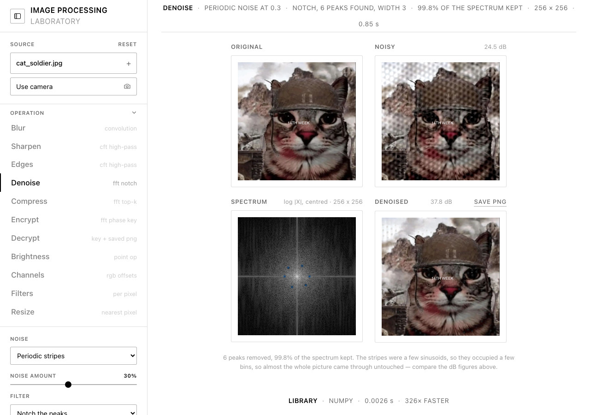

## Contents

- [Using the app](#using-the-app)
- [Features](#features):
  [Blur](#blur) ·
  [Sharpen](#sharpen) ·
  [Edges](#edges) ·
  [Denoise](#denoise) ·
  [Compress](#compress) ·
  [Encrypt](#encrypt) ·
  [Decrypt](#decrypt) ·
  [Brightness](#brightness) ·
  [Channels](#channels) ·
  [Filters](#filters) ·
  [Resize](#resize)
- [Authors](#authors)
- [Tech Stack](#tech-stack)
- [Setup and Configuration](#setup-and-configuration)

## Using the app

1. **Choose a picture.** Click the **+** box to pick a file, or **Use camera**
   to take a photo with your webcam (the browser asks for permission the
   first time).
2. **Pick an operation** from the list in the sidebar. The arrow next to
   *Operation* collapses the list to the one you picked, which leaves more
   room for its controls.
3. **Set the controls** and press the operation's button (*Apply blur*,
   *Denoise*, *Encrypt*, ...).
4. **Read the result.** The top of the page shows the original beside our
   output, with the settings and the time taken. Below it, the same job done
   by a library, how much faster it was, and how close the two results are.

On every result page you can also:

- **Save png** above any image to download it.
- **Click any image** to see it full screen, scaled up without smoothing so
  every pixel stays sharp. Click or press Esc to close it.
- **Show** the *Method* panel at the bottom for the call flow through the code
  and the equations behind the operation.

The picture you chose stays selected from one run to the next. **Reset**
clears it, and the button in the top-left corner hides the sidebar.

Large pictures are shrunk before processing: to 500 px on the longer side for
most operations, and to 256 px for Denoise, Compress and Encrypt. The
hand-written algorithms are plain Python loops, so this keeps each run to a few
seconds.

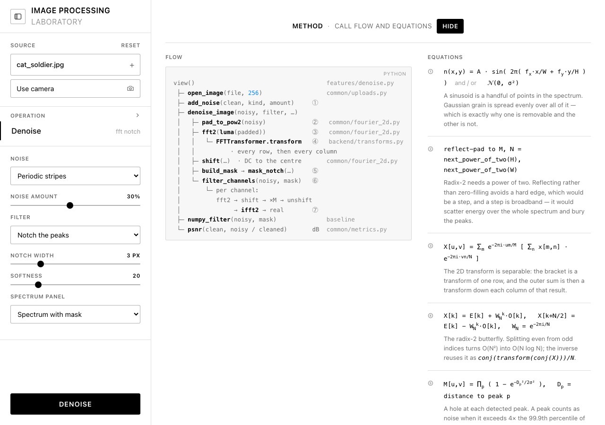

## Features

### Blur

Blurs the picture by averaging each pixel with its neighbours. The kernel
decides the kind of blur.

| Control | What it does |
| --- | --- |
| Kernel | **Box** (flat average), **Gaussian** (soft), **Circular** (lens blur) or **Motion** (a streak) |
| Kernel size | 3×3 up to 11×11. Bigger is blurrier, and slower: 11×11 on a 500 px picture takes about 10 s |
| Angle | *Motion only.* Direction of the streak, 0° to 180° |

Compared against Pillow's `BoxBlur` for the box kernel and SciPy for the
others. The two results agree to within 1 grey level.

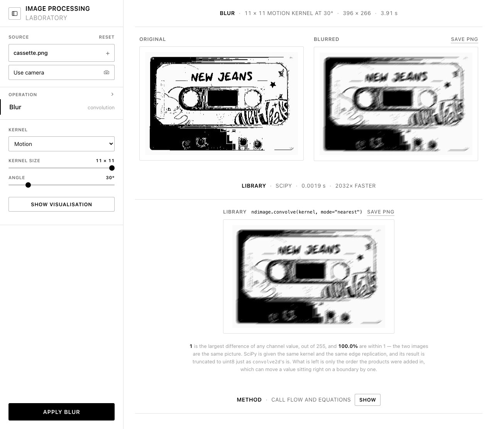

**Show visualisation** (in the sidebar, before you press *Apply blur*) animates
the box-kernel convolution on your own picture, pixel by pixel. It has Play,
Step and Reset buttons, speed and zoom settings, and a *Grid* mode that works
on a small grid of cells for a closer look. With the box kernel, the animation
produces exactly the same pixels as *Apply blur*.

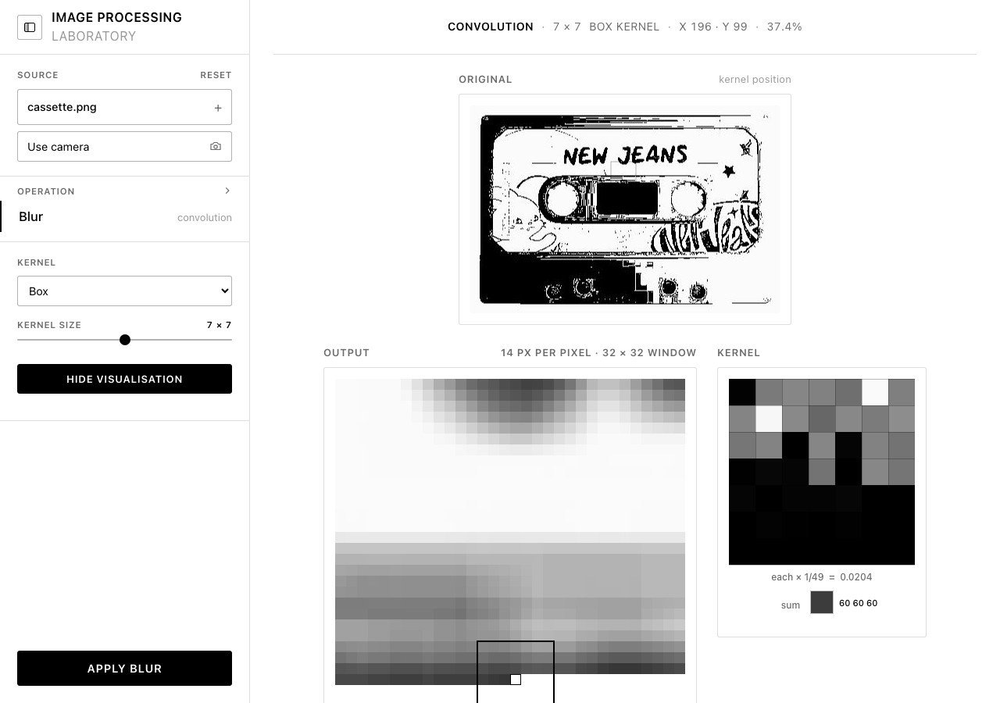

### Sharpen

Makes edges and texture crisper by boosting the fine detail in the picture.

| Control | What it does |
| --- | --- |
| Cutoff radius | 1 to 60. How fine a detail must be to get boosted. Higher values sharpen only the finest detail |
| Amount | 0 to 3. How strongly the detail is added back. 0 leaves the picture unchanged |

Shown beside Pillow's `UnsharpMask`. It works differently, so the two are
compared by eye rather than pixel by pixel.

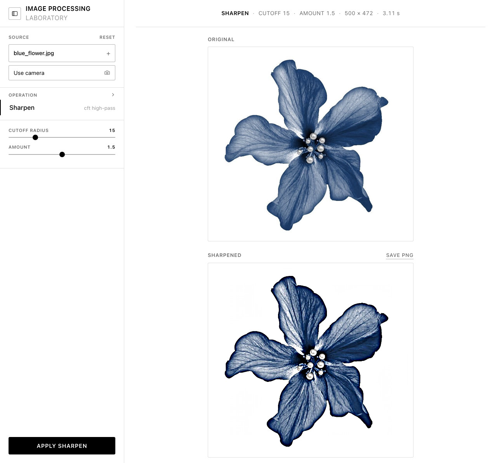

### Edges

Finds the edges in the picture and draws them as dark lines on white.

| Control | What it does |
| --- | --- |
| Cutoff radius | 1 to 60. Higher values keep only the sharpest edges; lower values also keep softer outlines |

Shown beside Pillow's `FIND_EDGES`, a different method, so it is compared by eye.

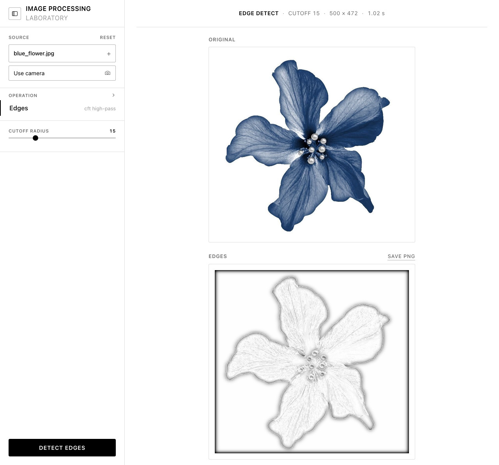

### Denoise

Adds noise to your picture, then removes it in the frequency domain. The page
shows the noisy picture, the picture's spectrum with the filter drawn over it,
and the cleaned result. Under the noisy and cleaned pictures is their PSNR
(higher means closer to the original).

| Control | What it does |
| --- | --- |
| Noise | **Periodic stripes**, **Grain** (random speckle) or **Both** |
| Noise amount | 5% to 60% |
| Filter | **Notch the peaks** (removes the stripes' bright spots from the spectrum), **Gaussian low-pass** (soft blur) or **Hard circular low-pass** (sharp cut, which leaves ripples) |
| Notch width | *Notch only.* Size of each hole, 0.5 to 12 px |
| Cutoff radius | *Low-pass only.* How much of the spectrum to keep, 4 to 120 px |
| Softness | How gradually the filter fades from keep to remove, 0 to 100. The hard low-pass ignores it |
| Spectrum panel | Draw the spectrum **with the mask**, the **spectrum only**, or only what was **discarded** |

Stripes are removed almost perfectly by the notch filter. Grain can only be
reduced with a low-pass filter, which also blurs. If the notch filter reports
no peaks found, raise the noise amount or the notch width.

Compared against the same filter run with `numpy.fft`; the two agree to within 1 grey level.

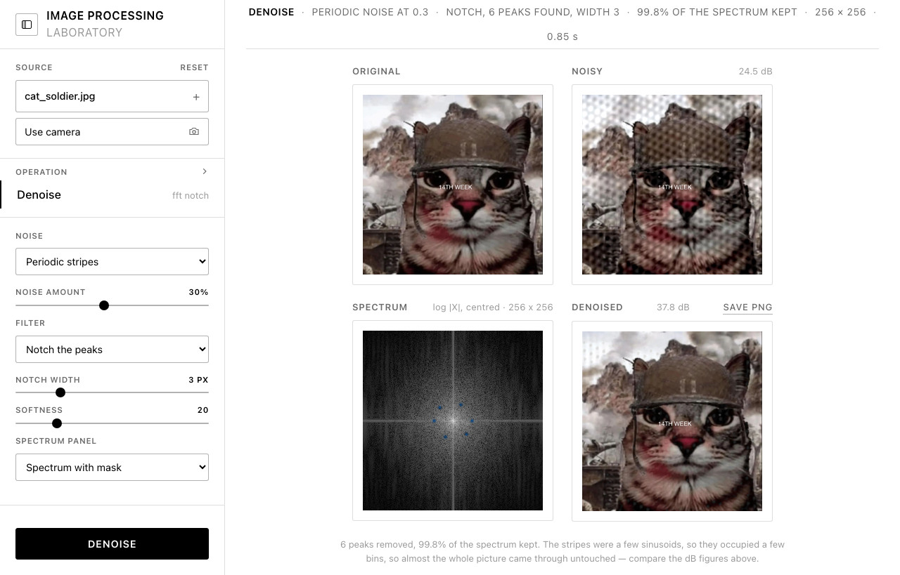

### Compress

Keeps only the strongest Fourier coefficients of the picture and rebuilds it
from them. The page shows the rebuilt picture, which coefficients were kept, a
JPEG saved at the same file size, and a table comparing size, ratio, loss,
quality and PSNR.

| Control | What it does |
| --- | --- |
| Coefficients kept | 0.5% to 25%. Fewer means a smaller file and a blurrier, more rippled picture |

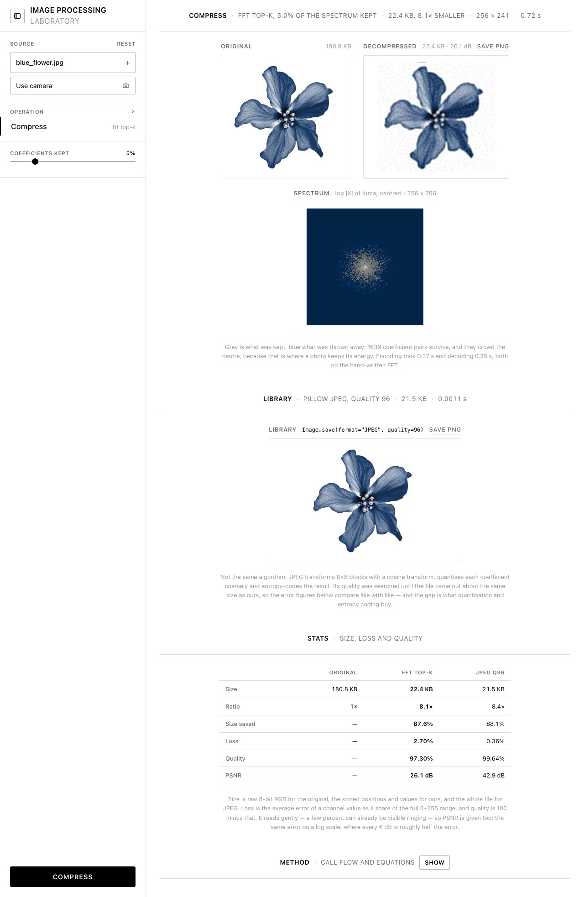

### Encrypt

Scrambles the picture with a passphrase, so that it looks like noise. Nothing
is thrown away, so the right passphrase brings the picture back. The page
shows the ciphertext, the spectra of the original and the ciphertext, and a
table with the neighbour correlation and entropy of both.

| Control | What it does |
| --- | --- |
| Cipher | **Double random phase**: scrambles more thoroughly, but can't be saved as an ordinary picture, so it can't be decrypted later. **Phase only (real image)**: saves as a normal PNG that Decrypt can open |
| Passphrase | Any text. Left empty, it is `cse220` |

To decrypt later, choose **Phase only**, then **Save png** on the ciphertext.
The file keeps the settings Decrypt needs, so you only have to remember the
passphrase.

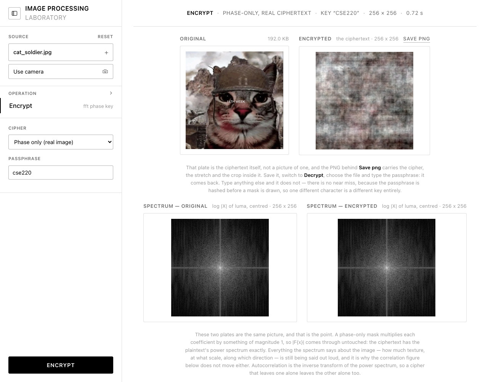

### Decrypt

Turns a saved ciphertext back into the picture.

| Control | What it does |
| --- | --- |
| Source | The ciphertext PNG saved from Encrypt |
| Passphrase | The passphrase it was encrypted with. Left empty, it is `cse220` |

With the right passphrase the picture comes back. With a wrong one, even one
character off, you get a different kind of noise.

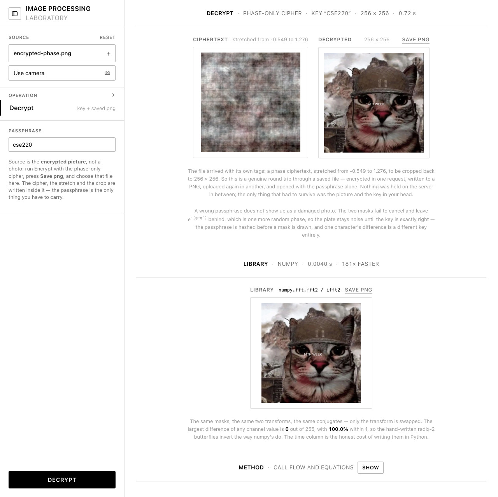

### Brightness

Makes the picture lighter or darker by multiplying every value by a gain.

| Control | What it does |
| --- | --- |
| Gain | 0× (black) to 2×. 1× leaves the picture unchanged |

Compared against Pillow's `ImageEnhance.Brightness`.

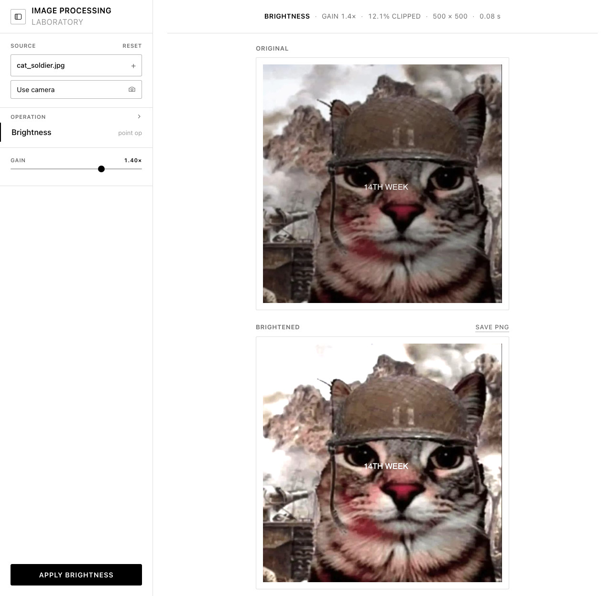

**Live preview.** Brightness, Channels, Filters and Resize change each pixel
on its own, so the browser can redo them instantly. Once a picture is chosen,
moving a slider updates a preview straight away; *Apply* then runs the Python
version and adds the library comparison.

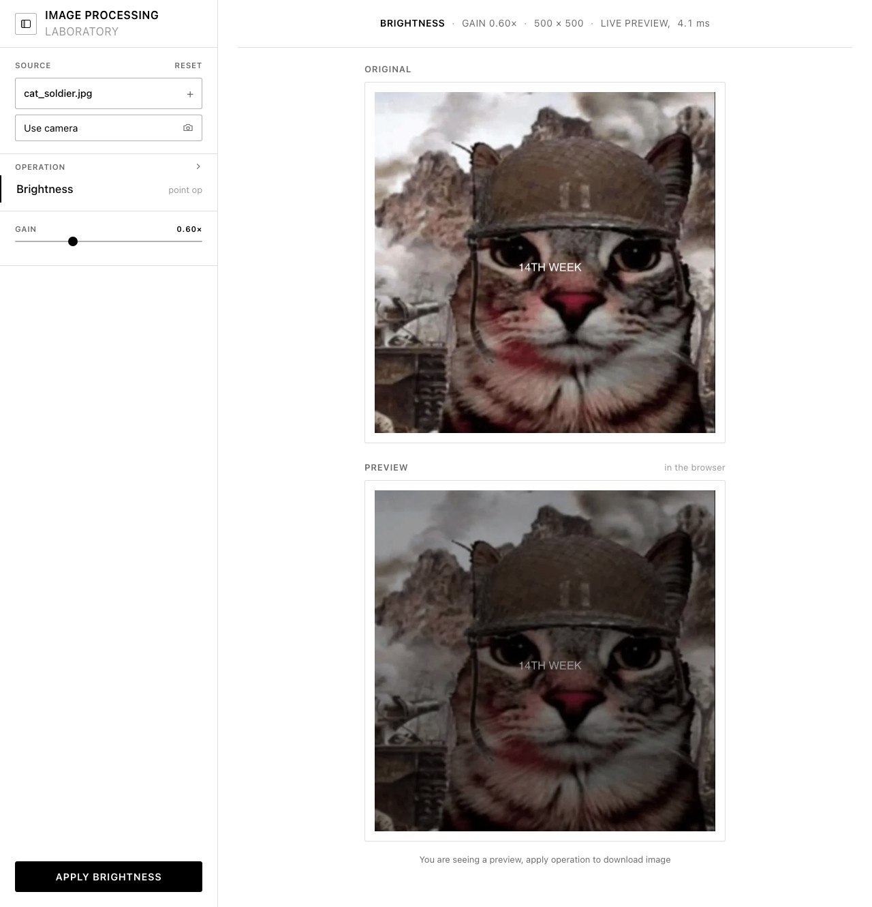

### Channels

Shifts the red, green and blue channels up or down separately, to add or
remove a colour cast.

| Control | What it does |
| --- | --- |
| Red, Green, Blue | −255 to +255 each. Added to every pixel of that channel |

Compared against Pillow's `Image.point` with a lookup table; the results match exactly.

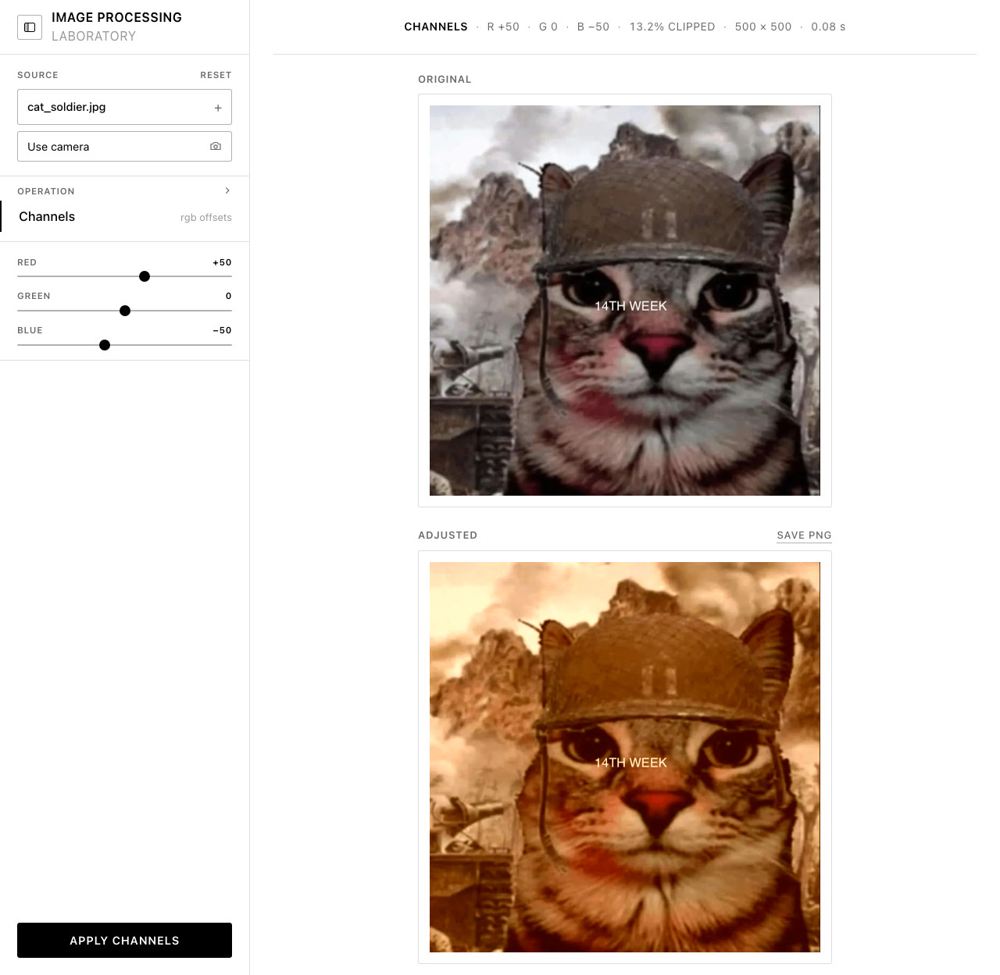

### Filters

Five photo filters, each with one slider.

| Filter | Slider |
| --- | --- |
| **Grayscale** | Amount, 0% to 100% |
| **Invert** | Amount, 0% to 100% (100% is a full negative) |
| **Black & white** | Threshold, 0 to 255. Pixels at or above it turn white, the rest black |
| **Pixelate** | Block size, 2 to 32 px |
| **Vintage** | Amount, 0% to 100% (sepia tone) |

Compared against Pillow doing the same job.

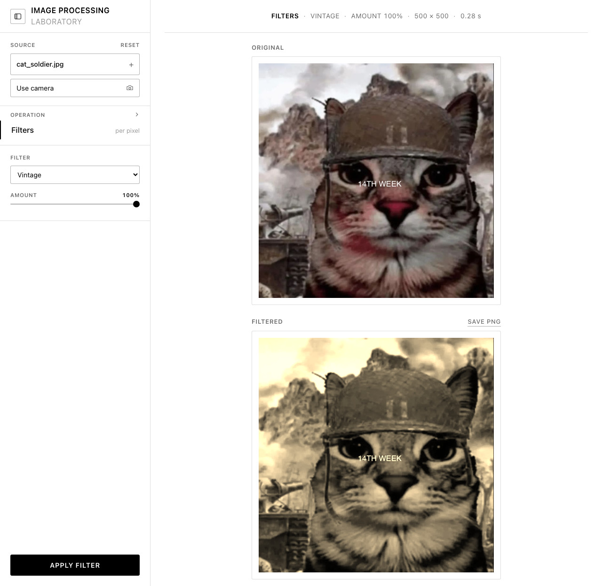

### Resize

Makes the picture bigger or smaller with nearest-neighbour sampling: every new
pixel copies the old pixel under its centre. Enlarged pictures look blocky.

| Control | What it does |
| --- | --- |
| Scale | 10% to 200% |

Compared against Pillow's `resize` with `NEAREST`; the results match exactly.

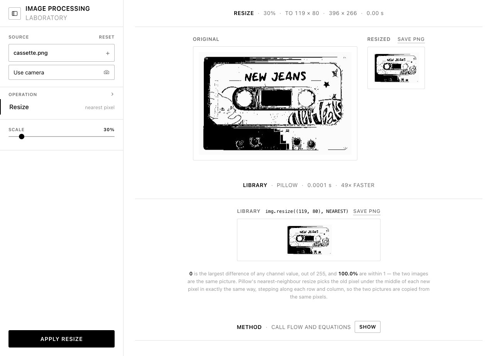

## Authors

| Name | Student ID | GitHub |
| --- | --- | --- |
| Zarif Ishmam | 2305035 | [@ishmamzarif](https://github.com/ishmamzarif) |
| Zarif Mahir | 2305032 | [@zarifmahir](https://github.com/zarifmahir) |

CSE220 Signals and Systems Sessional Course, Department of CSE, BUET.

## Tech Stack

| Part | Built with |
| --- | --- |
| Server | Python 3.14, Flask 3.1, Jinja2 templates |
| Image algorithms | Hand-written Python. NumPy is used for array arithmetic only, never for an FFT or convolution |
| Library baselines | Pillow, SciPy (`ndimage`) and `numpy.fft`, used only for the side-by-side comparisons |
| Front end | HTML, CSS and plain JavaScript: canvas for the visualiser and live previews, IndexedDB to keep the chosen picture, the camera API for photos |
| Equations | KaTeX |
| Hosting | Vercel |

## Setup and Configuration

### Run it locally

You need Python 3.14 (the version in `.python-version`).

```bash
git clone https://github.com/ishmamzarif/image-processing-lab.git
cd image-processing-lab

python -m venv .venv
source .venv/bin/activate          # macOS / Linux
source .venv/Scripts/activate      # Windows (Git Bash)

python -m pip install -r requirements.txt
python src/app.py
```

Then open <http://127.0.0.1:5000>.

To use the virtual environment in VS Code, press Ctrl+Shift+P (Cmd+Shift+P on
a Mac), run **Python: Select Interpreter**, and choose `.venv/bin/python`
(macOS / Linux) or `.venv\Scripts\python.exe` (Windows).

The camera only works on a secure page. `http://127.0.0.1` counts as one, and
so does the live site.

### Configuration

| Setting | Where | Default | What it controls |
| --- | --- | --- | --- |
| `MAX_DIM` | `src/backend/common/limits.py` | 500 | Longest side for Blur, Sharpen, Edges, Brightness, Channels, Filters and Resize. The front end reads the same value, so change it only here |
| `WORK_DIM` | `src/backend/common/limits.py` | 256 | Longest side for Denoise, Compress and Encrypt. Compress stores coefficient positions in 16 bits, which relies on this staying at 256 or below |
| `DEFAULT_KEY` | `src/backend/features/encrypt.py`, `decrypt.py` | `cse220` | Passphrase used when the box is left empty |

Raising the size limits makes every run slower: the algorithms are plain
Python loops, and an 11×11 blur at 500 px already takes about 10 seconds.

### Deployment

The site runs on Vercel, which serves the Flask app in `src/app.py` and
takes the Python version from `.python-version`. Static files live in
`public/static/`: Vercel serves that folder directly, and locally Flask serves
it too (`static_folder="../public/static"` in `src/app.py`).

### Project layout

```text
src/app.py                  entry point: maps each URL to a feature
src/backend/features/       one file per operation
src/backend/common/         helpers shared by the features
src/backend/transforms.py   the hand-written FFT, DFT and NTT
src/frontend/templates/     the page, split into partials
public/static/              CSS and JavaScript
presentation/               slides and the screenshots in this README
```
